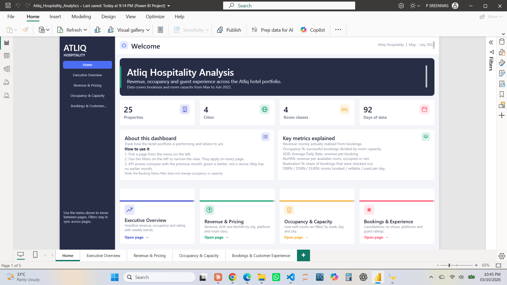
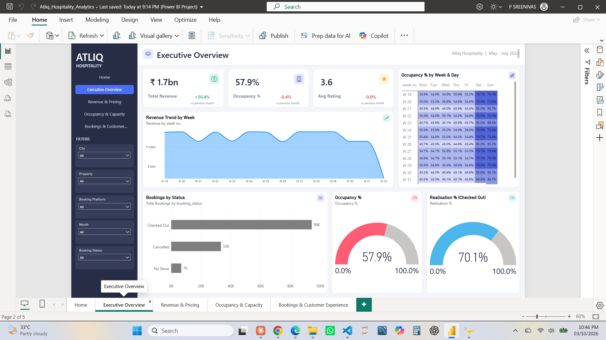
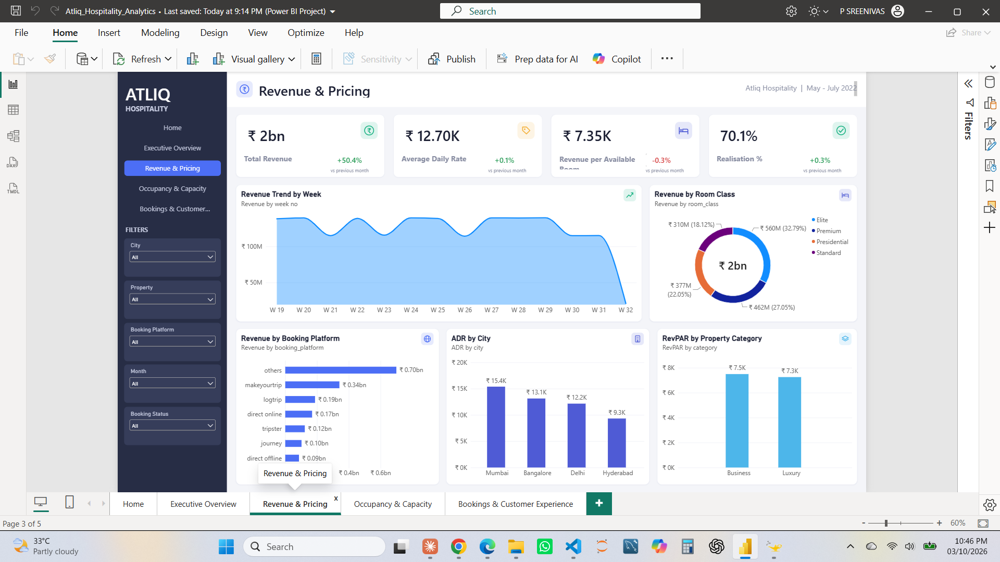
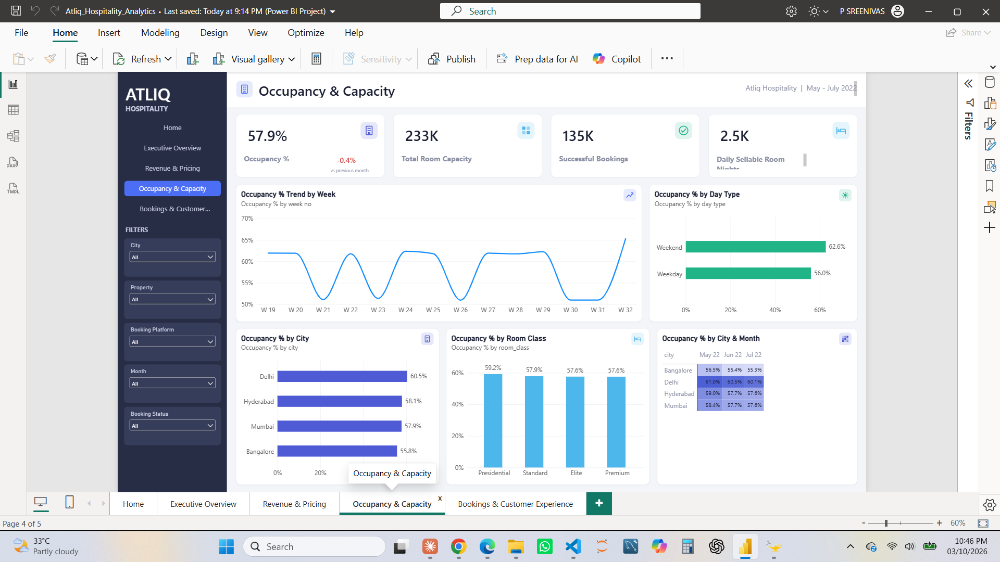
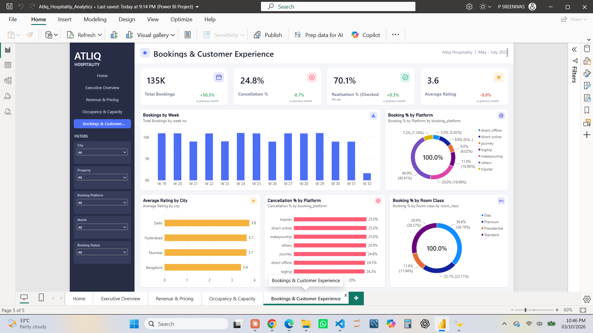

# Atliq Hospitality Analysis | Power BI Dashboard

A five-page Power BI dashboard that analyses revenue, occupancy and guest experience for the Atliq hotel group: 25 properties in 4 cities (Delhi, Mumbai, Hyderabad and Bangalore), using booking data from May to July 2022.

This project was built for the **Atliq Hospitality analytics challenge by [Codebasics](https://codebasics.io)**.

## Dashboard preview

**Home**

**Executive Overview**

**Revenue & Pricing**

**Occupancy & Capacity**

**Bookings & Customer Experience**

## Business questions

- How much revenue are the hotels realising, and how is it changing month to month?
- How well are rooms being filled, by city, room class, week and day type?
- Which booking platforms bring the most bookings, and which have the most cancellations?
- How satisfied are guests, and where are ratings highest or lowest?

## Dashboard pages

| Page | What it shows |
|---|---|
| **Home** | Introduction to the report, key facts, how to use the filters, metric definitions and navigation tiles |
| **Executive Overview** | Revenue, Occupancy % and Average Rating with month-over-month change, weekly revenue trend, occupancy heatmap by week and weekday, bookings by status, occupancy and realisation gauges |
| **Revenue & Pricing** | Revenue, ADR, RevPAR and Realisation %; revenue trend, revenue by room class, platform, ADR by city, RevPAR by property category |
| **Occupancy & Capacity** | Occupancy %, capacity, successful bookings and daily sellable room nights; occupancy trend, occupancy by day type, city and room class, city-by-month heatmap |
| **Bookings & Customer Experience** | Total bookings, cancellation %, realisation % and average rating; weekly bookings, platform and room-class mix, rating by city, cancellation % by platform |

Filters for City, Property, Booking Platform, Month and Booking Status are synced across all pages.

## Data model

Star schema with 3 dimension tables and 2 fact tables.

| Table | Type | Description |
|---|---|---|
| `dim_date` | Dimension | Dates for May to July 2022, with week, weekday, month and weekend/weekday flags |
| `dim_hotels` | Dimension | 25 properties with name, category (Luxury or Business) and city |
| `dim_rooms` | Dimension | Room types RT1 to RT4 and their class (Standard, Elite, Premium, Presidential) |
| `fact_bookings` | Fact | One row per booking: dates, guests, platform, rating, status and revenue |
| `fact_aggregated_bookings` | Fact | Daily capacity and successful bookings by property and room type |

Both fact tables relate to the three dimensions (date, property and room type).

## Measures

The model has **60 DAX measures** in a dedicated `_Measures` table, each with a description and grouped into display folders:

- **Revenue & Pricing:** Revenue, ADR, RevPAR
- **Bookings:** Total Bookings, Checked Out, Cancelled, No Show, Successful Bookings
- **Booking Status Rates:** Cancellation %, No Show rate %, Realisation %
- **Capacity & Occupancy:** Total Capacity, Occupancy %, No of days, DBRN, DSRN, DURN
- **Customer:** Average Rating
- **Booking Mix:** Booking % by Platform, Booking % by Room class
- **Week over Week:** WoW change % for Revenue, Occupancy, ADR, RevPAR, Realisation and DSRN
- **Month over Month:** previous-month values and change % for the main KPIs
- **Conditional Formatting:** colour measures that turn KPI changes green or red (red for an increase in Cancellation %)

Key definitions:

- **Revenue** is realised revenue. Cancelled bookings keep 60% of their value.
- **Occupancy %** = successful bookings / room capacity.
- **ADR** = revenue / total bookings.
- **RevPAR** = revenue / total room capacity.
- **Realisation %** = share of bookings that were checked out.

## Technologies

- Power BI Desktop (PBIP project format, so the model and report are stored as readable files)
- DAX and Power Query (M)
- VS Code
- Claude Code (AI assistant) for building the model, measures and report layout. I reviewed and tested every measure and visual in Power BI Desktop.

## How to open this project

The data files are **not included** in this repository.

1. Clone or download this repository.
2. Download the Atliq Hospitality datasets from the Codebasics challenge. You need `dim_date.csv`, `dim_hotels.csv`, `dim_rooms.csv`, `fact_aggregated_bookings.csv` and `fact_bookings.csv`.
3. Save the five CSV files in one folder on your computer.
4. Open `Atliq_Hospitality_Analytics.pbip` in Power BI Desktop (a recent version with the developer mode and PBIP support turned on).
5. Go to **Home → Transform data → Edit parameters**, set **DataFolderPath** to the folder from step 3, and click **OK**.
6. Click **Refresh**.

## Notes

- The **Booking Status** filter changes booking measures only. Occupancy and capacity come from the daily room data, which has no booking status.
- April data is not available, so the month-over-month comparison for May shows no change.

## Acknowledgements

Thanks to **[Codebasics](https://codebasics.io)** for the challenge and for the data analytics bootcamp where I learned Power BI, DAX and data modelling.

## Author

**Sreenivas P**
GitHub: [sreenivaspannati22-dotcom](https://github.com/sreenivaspannati22-dotcom)
